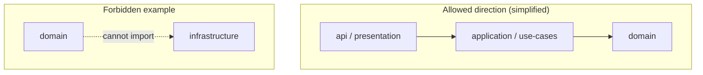

# Layer Lock (`layerlock`)

**Build-time architecture validation for TypeScript.** Declare layer folders and forbidden imports in **`layerlock.config.ts`** (legacy **`arch.config.ts`** is still discovered); **CI fails when the static import graph breaks your rules.** **No runtime dependency** in your application.

Keep NestJS, Express, Nx, or plain workspaces — layerlock only enforces **which layers may import which**.

---

## In ~30 seconds

```bash
npm i -D layerlock typescript
```

**`layerlock.config.ts`** (next to `tsconfig.json`; `npx layerlock init` creates this file):

```ts
import { defineArchitecture, layer } from "layerlock";

export default defineArchitecture({
  tsconfig: "tsconfig.json",
  layers: {
    domain: ["src/domain/**/*.ts"],
    infra: ["src/infra/**/*.ts"],
  },
  rules: [layer("domain").cannotImport("infra")],
});
```

**`package.json`:** use **`"layerlock": "layerlock"`** so **`npm run layerlock`** and **`npm run layerlock check`** both validate (npm appends extra args to the script; avoid baking **`check`** into the script itself).

Run **`npm run check:arch`**, **`npm run layerlock`**, or **`npx layerlock`**. If someone adds `import ...` from domain into infra, you get a **clear violation block** (file, line, rule, hint) and exit code **`1`**.

Use **`-f json`** for CI parsers; **`layerlock explain src/a.ts src/b.ts`** to see whether an edge is allowed.

---

## Visual model (intent)

Onion-style layers: **inner** modules must not depend on **outer** modules. Allowed dependencies point **inward**; layerlock flags edges that go the wrong way.



*(Diagram is illustrative; your real globs and rules live in `layerlock.config.ts`.)*

---

## Contents

- [In ~30 seconds](#in-30-seconds)
- [Visual model](#visual-model-intent)
- [What it solves](#what-it-solves)
- [How it works](#how-it-works)
- [Requirements and footprint](#requirements-and-footprint)
- [Install and quick start](#install-and-quick-start)
- [Real-world examples](#real-world-examples)
- [Ways to run](#ways-to-run)
- [Scaffold a layout](#scaffold-a-layout)
- [Presets and rules](#presets-and-rules)
- [Further documentation](#further-documentation)
- [Why not ESLint?](#why-not-eslint)
- [CLI reference](#cli-reference)
- [AI-assisted development](#ai-assisted-development)
- [License and author](#license-and-author)

---

## What it solves

Teams intend **layered or modular** dependencies, but the real **import graph** drifts: refactors, path aliases, and tooling-friendly edits still type-check while breaking that intent.

**layerlock** encodes allowed directions in **`layerlock.config.ts`** (or legacy **`arch.config.ts`**) and fails CI when a forbidden **`import`** appears. For **why drift is costly**, **non-goals**, and **MVP analysis limits**, see [**Overview and rationale**](docs/overview.md).

---

## How it works

1. **Layers** — Name layers and map them with **picomatch** globs (for example `src/domain/**/*.ts`).
2. **Rules** — Express forbidden edges with **`layer("a").cannotImport("b")`**, optional **`exceptFrom`** for tests or generated code.
3. **TypeScript program** — Load your **`tsconfig.json`** and resolve imports the way the compiler does (`paths`, `extends`, typical monorepo setups).
4. **Static analysis** — Resolve statically visible import edges, classify them against layers, and report violations with location and **hint** (exact import forms covered: [**MVP limitations**](docs/overview.md#limitations-mvp)).

Validation runs at **build or CI time**. It does not replace Nest, Express, or Nx; it enforces **import-level** architecture on top of whatever stack you use.

---

## Requirements and footprint

**In your app:** no runtime dependency — use **layerlock** as a **devDependency** only. **Distribution:** **ESM**, build target **Node 18**.

**Environment:** Node **18+**, a normal **TypeScript** project with **`tsconfig.json`**, consume this package from **ESM** (or dynamic **`import()`**). Bundled npm dependencies and version notes: [**Requirements and dependencies**](docs/requirements.md).

---

## Install and quick start

The fastest path is [**In ~30 seconds**](#in-30-seconds) above. Here is the same flow with a **three-layer** example and a reminder about **`root`**:

```bash
npm i -D layerlock typescript
```

Add **`layerlock.config.ts`** next to the **`tsconfig.json`** you want to enforce (or keep using legacy **`arch.config.ts`**). The CLI pins **`root`** to the config directory by default — **avoid setting `root` yourself** unless you have a specific reason.

```ts
import { defineArchitecture, layer } from "layerlock";

export default defineArchitecture({
  tsconfig: "tsconfig.json",
  layers: {
    domain: ["src/domain/**/*.ts"],
    infra: ["src/infra/**/*.ts"],
    api: ["src/api/**/*.ts"],
  },
  rules: [
    layer("domain").cannotImport("infra", "api"),
    layer("api").cannotImport("infra"),
  ],
});
```

**`package.json`:**

```json
{
  "scripts": {
    "layerlock": "layerlock",
    "check:arch": "layerlock"
  }
}
```

Run **`npm run check:arch`**, **`npm run layerlock`**, or **`npx layerlock`**. Exit code **`1`** on violations or configuration errors; **`0`** when clean.

---

## Real-world examples

| Location | What to copy |
|----------|----------------|
| [**examples/simple**](examples/simple/) | Minimal three-layer project with a deliberate violation (`npm run layerlock`). |
| [**examples/monorepo**](examples/monorepo/) | Workspaces + `tsconfig` paths and cross-package boundaries. |
| [**docs/nestjs.md**](docs/nestjs.md) | Nest-style layering, **`presets.nestRecommended()`**, **`layerlock init --nest`**. |
| **`fixtures/nest-app`** (in this repo) | Larger Nest-shaped fixture used in tests; good for reading patterns, not published as a template package. |
| **`fixtures/express-hexagonal-app`** (in this repo) | Express + **`presets.hexagonal()`** layout; **`npm test`** in that folder runs CLI and programmatic API smoke against the linked package. |

See [**examples/README.md**](examples/README.md) for commands.

---

## Ways to run

### CLI

The default command validates the project. Options are summarized in [CLI reference](#cli-reference); discovery rules are described in **`layerlock --help`**.

### Programmatic

```ts
import { formatLayerlockText, layerlockCheck } from "layerlock";

const run = await layerlockCheck({ cwd: process.cwd() });
if (!run.ok) {
  console.error(formatLayerlockText(run));
  process.exit(1);
}
```

Same configuration discovery as the CLI. Returns **`{ ok, result, validated, configPath }`**.

### Advanced embedding

For custom tooling, use **`resolveToValidatedArchitecture()`** and **`validate()`** (alias **`validateArchitecture`**) from the package exports (see [`src/public-api/`](src/public-api/) and [`src/config/`](src/config/)).

---

## Scaffold a layout

```bash
npx layerlock init --nest        # four-layer preset + default test/e2e exceptions
npx layerlock init --clean       # same folders; stricter defaults in tests
npx layerlock init --clean-arch  # alias for --clean (empty repo → clean architecture layout)
npx layerlock init --hexagonal   # ports/adapters: domain → ports → application → adapters
# npx layerlock init --clean-arch --force   # replace existing layerlock.config.ts
```

Creates **`layerlock.config.ts`** (via **`layerlock init`**), layer directories under **`src/`** (with **`.gitkeep`**), and a **minimal `tsconfig.json` only if none exists**. Details of the layout are described in the [**NestJS**](docs/nestjs.md) and [**Express / minimal HTTP**](docs/express-plain-node.md) guides.

---

## Presets and rules

| Preset | Use case |
|--------|----------|
| **`presets.layeredFromInnerToOuter`** | Generic onion: layers listed **inner -> outer**; inward imports forbidden. |
| **`presets.cleanArchitectureFourLayer`** | Opinionated four-layer names and default **`src/...`** globs. |
| **`presets.nestRecommended`** | Same onion as clean four-layer, plus **default `exceptFrom`** for tests and e2e (see [**NestJS guide**](docs/nestjs.md)). |
| **`presets.hexagonal`** | Ports and adapters naming (`domain` -> `ports` -> `application` -> `adapters`). |
| **`presets.dddLite`** | DDD-oriented layer names (`domain`, `application`, `infrastructure`, `interfaces`). |
| **`presets.nxStyle`** | Starting-point globs for **`libs/`** / **`apps/`** / **`packages/`** style trees (tune per repo). |

**Escape hatches:** **`layer("a").cannotImport("b", { exceptFrom: ["**/*.spec.ts"] })`** skips the rule for matching **source** files; **`ignoreFileGlobs`** on **`defineArchitecture`** excludes paths entirely (for example codegen).

```ts
import { defineArchitecture, presets } from "layerlock";

export default defineArchitecture({
  tsconfig: "tsconfig.json",
  ...presets.nestRecommended({ baseDir: "src" }),
});
```

---

## Further documentation

The guide index is [**docs/README.md**](docs/README.md). Maintainer workflow: [**CONTRIBUTING.md**](CONTRIBUTING.md).

---

## Why not ESLint?

Many teams already use **ESLint** for style and correctness. layerlock does **one thing**: enforce **named layer boundaries** using the **same import resolution as TypeScript**, with a small API and presets.

A longer, honest comparison (including when ESLint or Nx is enough) is in [**docs/why-not-eslint.md**](docs/why-not-eslint.md).

---

## CLI reference

| Item | Behavior |
|------|----------|
| **`layerlock`** or **`layerlock check`** | Validate (search upward for **`layerlock.config.*`**, then legacy **`arch.config.*`** / **`architecture.config.ts`**). |
| **`layerlock explain <from> <to>`** | Print each file’s **layer** and whether a **`cannotImport`** rule would forbid that edge (exit **`1`** if forbidden). |
| **`layerlock init --nest` \| `--clean` \| `--clean-arch` \| `--hexagonal`** | Scaffold **`layerlock.config.ts`** and layer folders (**`--hexagonal`**: domain/ports/application/adapters + infrastructure); **`--clean-arch`** = **`--clean`**; **`--force`** overwrites the config file. |
| **`-c, --config <path>`** | Explicit configuration path (not combinable with **`--discover`**). |
| **`--discover`** | Find every **`layerlock.config.*`** / **`arch.config.*`** under the working directory and validate each package in parallel. |
| **`--watch`** | Re-run on file changes (daemon; does not exit). Not compatible with **`--graph`**. |
| **`--stable`** | Deterministic ordering for violations and JSON (diff-friendly CI logs). |
| **`--ci-diff`** | Stricter CI mode: implies **`--stable`**, normalizes paths to **POSIX** and **repo-relative** under each package root, POSIX **`--discover`** section headers, and **deterministic JSON key order** (stable field order per violation). |
| **`-f, --format text` \| `json`** | Human-readable report (ASCII-friendly text: dash rules, `->` layer edges, no box-drawing Unicode) or JSON (includes a **`summary`** object). |
| **`--graph mermaid` \| `dot` \| `none`** | Aggregate layer graph (single-package only). Without **`--graph-out`**, writes **`layerlock-layers.mmd`** or **`layerlock-layers.dot`** under the **project root** (directory of the config file unless `root` is set). **`--graph-out <path>`** overrides (path relative to cwd). Confirmation prints to **stderr** so **`stdout`** stays clean for **`-f json`**. |
| **`-h`, `--help`** | Help for validate, **`init`**, or **`explain`**. |

**JSON schema:** **`layerlock/schema`** (file **`schemas/layerlock.config.schema.json`**) for editor completion and agents.

**Validate exit codes:** **`0`** success, **`1`** violations or configuration error.

---

## AI-assisted development

Fast refactors, path aliases, and **AI-generated edits** all increase the risk that the **import graph** drifts while **`tsc` still passes**. layerlock is designed to sit in **CI** and catch those regressions early.

1. Edit **`layerlock.config.ts`** using the public API (**`defineArchitecture`**, **`layer`**, **`presets`**).
2. Run **`layerlock`** locally or in CI; failures include **rule**, **location**, **resolved module**, and **actionable hints**.
3. Use **`-f json`** for tools, dashboards, and agent loops that parse results.
4. Import **`LAYERLOCK_AI_CONFIG_GUIDE`** from **`layerlock`** so assistants stay aligned with the configuration contract.
5. Use **`layerlock explain <from.ts> <to.ts>`** when a failure (or a proposed edit) is unclear: it prints **layers** and whether the edge is **allowed**.

---

## License and author

**License:** MIT — see [`LICENSE`](LICENSE).

**Author:** Joao Otavio Carvalho Castejon.

Contributions: [**CONTRIBUTING.md**](CONTRIBUTING.md).
